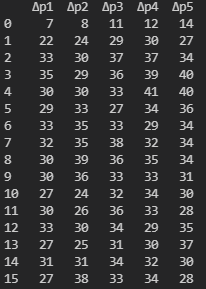
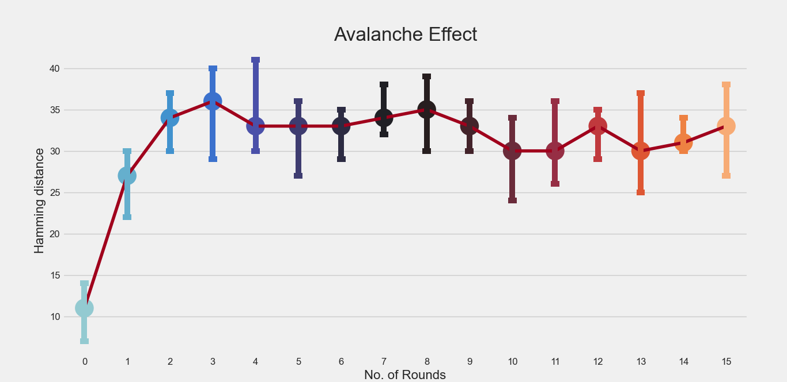
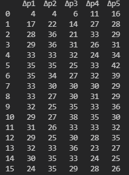
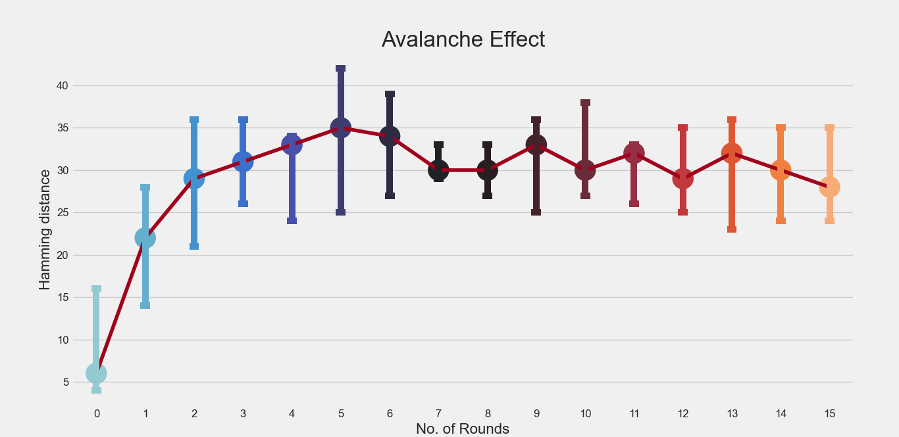

# Network-Security-CSE-537

## Practical Assignment 1

Perform experiments to explore the Avalanche Effect progression across the DES rounds. Use (i) 5 different plaintexts (ii) 5 different Hamming distances (HD) (iii) 5 different secret keys. Report plots of HD against round number. 

## Solution Approach

**Avalanche Effect** : A desirable property of any encryption algorithm is that a small change in either the plaintext or the key should produce a significant change in the ciphertext. In particular, a change in one bit of the plaintext or one bit of the key should produce a change in many bits of the ciphertext.

## Test 1 : 5 Plaintext with 5 different hamming distance

**The original plaintext** :  “10100100” (64 bit string)

**The original Key** : "00011100" (64 bit string)

text_list = ["±0100100", "ñ0100100", "60100100", "Á0100100", "10É00100"]

The above text_list contains plaintext with hamming distances 1, 2, 3, 4 and 5 with respect to original plaintext.

### Variation of Hamming distance in 16 rounds

 

Where column Δp1 denotes the hamming distance observed after a particular round of DES and so on.

### Point plot of Hamming distance vs No. of Rounds

## Test 2 : 5 Keys using 5 different hamming distance

**The original plaintext** :  “10100100” (64 bit string)

**The original Key** : "00011100" (64 bit string)

key_list = ["p0011100" ,"°0011100" ,"°0451±00" ,"d0451±00" ,"µút11100"]

The above key_list contains keys with hamming distances 1, 2, 3, 4 and 5 with respect to original key.

### Variation of Hamming distance in 16 rounds

 

Where column Δp1 denotes the hamming distance observed after a particular round of DES and so on.

### Point plot of Hamming distance vs No. of Rounds

## Practical Assignment 0

Write a program with a nice UI to Encipher / Decipher with the simple encryption algorithm discussed in the class.

## Solution Approach

The encryption idea is like :

a -> z || b -> y || c ->x || d -> w || ........................ || y -> b || z -> a

For 'a', since 'a' is the 1st beginning alphabet then the encrypted character of 'a' will be 1st alphabet from last i.e., 'z'.

For 'b', since 'b' is the 2nd beginning alphabet then the encrypted character of 'b' will be 2nd alphabet from last i.e., 'y' and so on.

The encryption algorithm has been mentioned in the code file (PA0.py). 

### Final GUI 

 

## Glimpse of Assignment 

 
