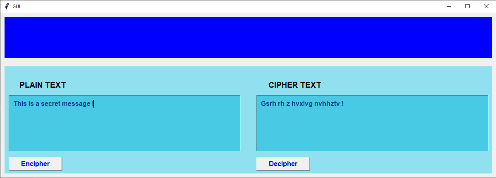
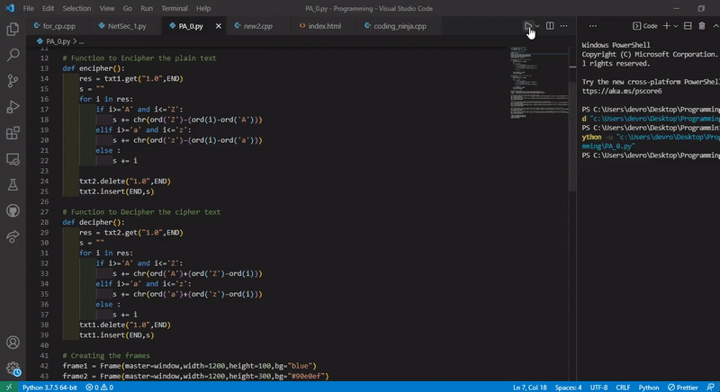

# Network-Security-CSE-537

## Practical Assignment 0

Write a program with a nice UI to Encipher / Decipher with the simple encryption algorithm discussed in the class.

## Solution Approach

The encryption idea is like :

a -> z || b -> y || c ->x || d -> w || ........................ || y -> b || z -> a

For 'a', since 'a' is the 1st beginning alphabet then the encrypted character of 'a' will be 1st alphabet from last i.e., 'z'.

For 'b', since 'b' is the 2nd beginning alphabet then the encrypted character of 'b' will be 2nd alphabet from last i.e., 'y' and so on.

The encrption algorithm has been mentioned in the code file (PA0.py). 

### Final GUI 

 

## Glimpse of Assignment 

 
